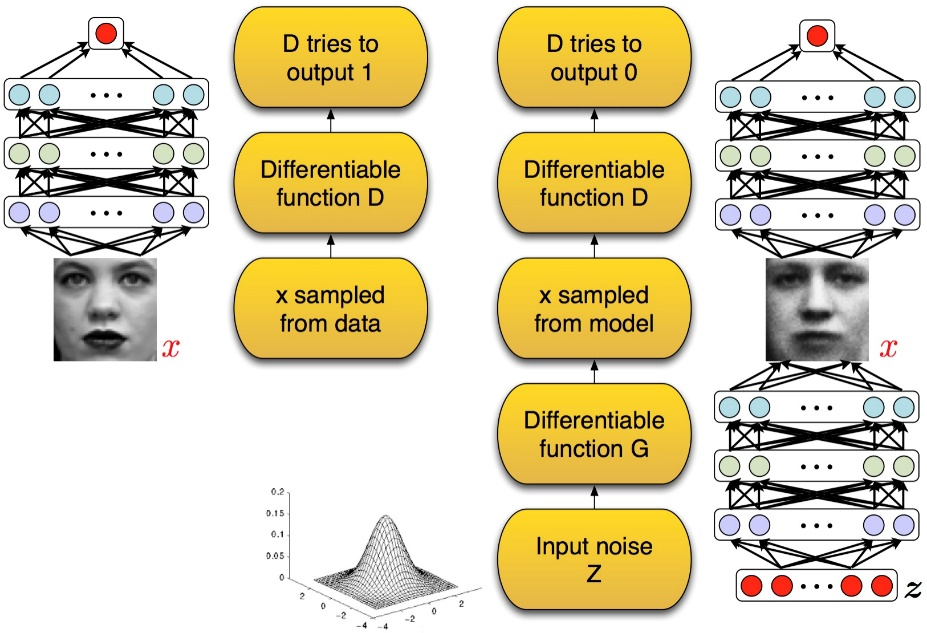
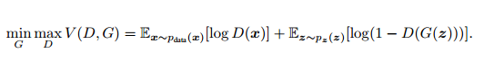

# GAN学习笔记
## GAN简介
* GAN 启发自博弈论中的二人零和博弈（two-player game），GAN 模型中的两位博弈方分别由生成式模型（generative model）和判别式模型（discriminative model）充当。生成模型 G 捕捉样本数据的分布，用服从某一分布（均匀分布，高斯分布等）的噪声 z 生成一个类似真实训练数据的样本，追求效果是越像真实样本越好；判别模型 D 是一个二分类器，估计一个样本来自于训练数据（而非生成数据）的概率，如果样本来自于真实的训练数据，D 输出大概率，否则，D 输出小概率。可以做如下类比：生成网络 G 好比假币制造团伙，专门制造假币，判别网络 D 好比警察，专门检测使用的货币是真币还是假币，G 的目标是想方设法生成和真币一样的货币，使得 D 判别不出来，D 的目标是想方设法检测出来 G 生成的假币。如图所示:  

* 损失函数:  

