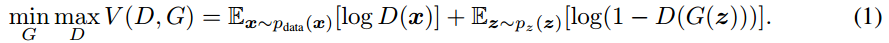

# GAN学习笔记
***
## 一、各类GAN简介
### 1.1  GAN
* GAN 启发自博弈论中的二人零和博弈（two-player game），GAN 模型中的两位博弈方分别由生成式模型（generative model）和判别式模型（discriminative model）充当。生成模型 G 捕捉样本数据的分布，用服从某一分布（均匀分布，高斯分布等）的噪声 z 生成一个类似真实训练数据的样本，追求效果是越像真实样本越好；判别模型 D 是一个二分类器，估计一个样本来自于训练数据（而非生成数据）的概率，如果样本来自于真实的训练数据，D 输出大概率，否则，D 输出小概率。可以做如下类比：生成网络 G 好比假币制造团伙，专门制造假币，判别网络 D 好比警察，专门检测使用的货币是真币还是假币，G 的目标是想方设法生成和真币一样的货币，使得 D 判别不出来，D 的目标是想方设法检测出来 G 生成的假币。如图所示:  

* 损失函数:  

### 1.2  CGAN
* 条件生成式对抗网络（CGAN）是对原始GAN的一个扩展，生成器和判别器都增加额外信息 y为条件, y 可以使任意信息,例如类别信息,或者其他模态的数据。网络结构为：  

* 损失函数:  

### 1.3  DCGAN
DCGAN的全称是Deep Convolutional Generative Adversarial Networks,即深度卷积对抗生成网络，它是由Alec Radford在论文Unsupervised Representation Learning with Deep Convolutional Generative Adversarial Networks中提出的。它在GAN的基础上增加深度卷积网络结构，专门生成图像样本，具有以下特征：
* 用Convolution层代替Pooling层:对于discriminator，容许网络学习自己的空间下采样;对于generator,容许网络学习自己的空间上采样。
* 在CNN中移除了全连接层。
* 使用batchnorm，解决初始化差的问题，并帮助梯度传播到每一层，同时防止generator把所有的样本都收敛到同一个点。但如果对所有层应用batchnorm会导致样本振荡和模型不稳定，所以对generator输出层和discriminator输入层没有使用。
* 在generator输出层使用tanh，其余层使用ReLU。
* 在discriminator的所有层使用Leaky ReLU。
